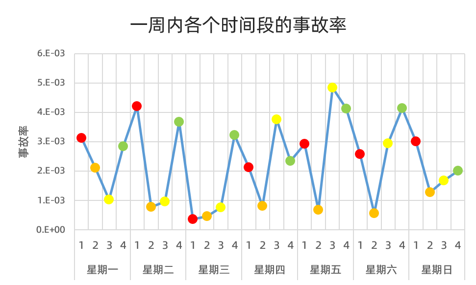

## 碰撞特征

主要从发生碰撞的时间、地点和速度分析碰撞特征

### 发生碰撞的时间分布

从上图可以看出，周末发生事故的概率要比工作日高一些。

每天分为四个时间段，分别为：0点-6点、6点到12点、12点-18点、18点-24点。红点是0点-6点，深黄色是6点-12点，黄色是12点-18点，绿色是18点-24点。

从这个图就可以看出来，普遍红色点是偏高的，绿色点也是偏高的，深黄色点大部分是偏低的。说明夜间行车，事故率会更高一些，反而上午驾驶的事故率稍微低一些。夜间驾驶的光线不好，自然事故率就比较高。上午驾驶时，精神状态比较好，驾驶比较谨慎，所以事故率会稍微低一些。

### 发生碰撞的地点分布

横坐标是车辆该月访问碰撞区域的访问频次。从图中可以看出，发生碰撞的地点是车辆不经常去的地点。说明驾驶者对陌生地点的路段不熟悉，加大了事故发生的概率。

### 发生碰撞时的速度分布

硬件能检测到碰撞是因为由于车辆的安全气囊弹出，所以是重大交通事故。不过从上图可以看出，发生碰撞车辆前的速度在[20, 50]的区间车辆最多，其次是[50, 80]速度区间，还有很多车辆的速度是[0, 20]。说明有一部分车辆是在低速状态下发生碰撞，那么极有可能是被其他车辆撞。这也是该项目中的最大难点。
