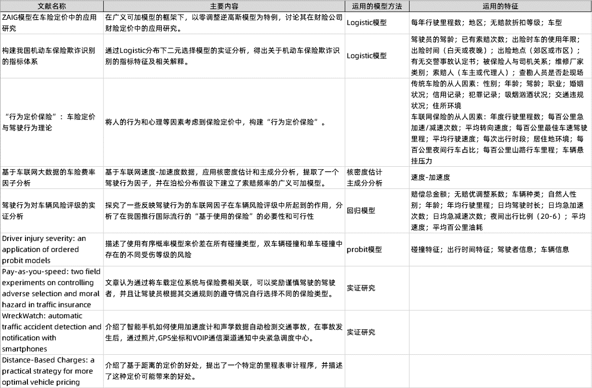

数据来源于国内某家大型汽车公司。利用车辆记录仪记录的车辆位置数据（下称轨迹数据）和速度加速度数据，刻画驾驶者的驾驶习惯，从而判断该车辆会发生碰撞的可能性。

### 项目意义

不仅能够让驾驶者了解自己的驾驶习惯，起到警觉的作用。

更重要的是可以应用到车险定价的场景中。

### 数据表介绍

数据时间范围：2018.01-2019.04

|数据表名|总数据量|相关车辆数量|数据表说明|
|--------|-------|-----------|---------|
|车辆基本信息表|约1.5万条|无碰撞：4000；重大碰撞：717；轻微碰撞：11107|包含车辆购买时间，车辆进站检修时间，车辆购买者的基本信息和是否发生碰撞的标签|
|车辆轨迹数据表|约3亿|无碰撞：3885；重大碰撞：685；轻微碰撞：10676|包含车辆行驶的轨迹数据，每分钟采集一次|
|车辆速度加速度数据表|约1.1亿|无碰撞：3576；重大碰撞：535；轻微碰撞：10642|包含车辆速度加速度数据，只有加速度>1.39m/s2才会采集数据|

### 文献综述

总结了一些国内外对车险定价的因子发现，大部分文献中所使用的特征都集中在速度加速度的内容和车辆的基本信息的内容，而对车辆行驶的位置信息的内容特征都尚未考虑进去。进而我们归纳总结了自己想要构建的特征工程的特征。

### 特征因子总结

特征因子分为三类，分别是：车辆基本特征、驾驶者基本特征、驾驶行为特征、其他特征

车辆基本特征：车龄、驾驶时是否载人、车型、累积驾驶里程

驾驶者基本特征：性别、年龄、是否酗酒、是否有暴力倾向、驾照类型、驾龄、职业

驾驶行为特征：移动特征（包括时间特征、空间特征）、速度加速度特征、碰撞时特征

其他特征：天气、路况等

